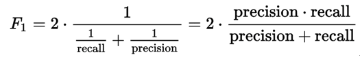
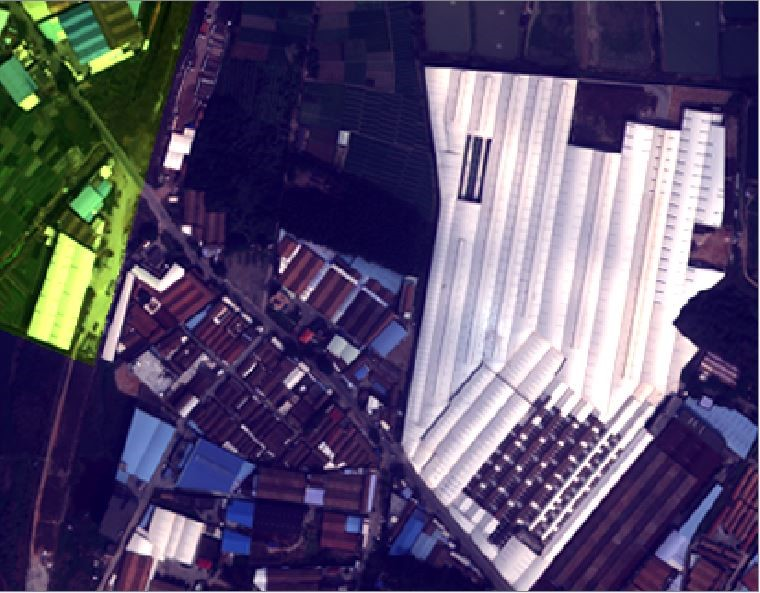
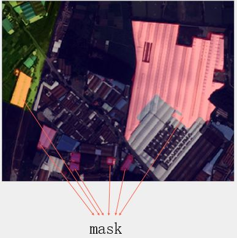

[ 天池大赛 > 广东政务数据创新大赛—智能算法赛](https://tianchi.aliyun.com/competition/introduction.htm?spm=5176.100066.0.0.5935d780QGGkRV&raceId=231615)

小组成员： 李楠 刘袁 王立杰 庄琰 王元成
小组排名： 31/2635

感谢小组成员的倾力付出！

### 一、竞赛题目
智能算法赛以“土地智能监管”为主题，使用2015年和2017年分别获取到的广东省某地的卫星图片，识别出两年之间新增的人工地上建筑物（不包括道路）所占的像元图斑。

### 二、评估指标

选手检测出的结果将和标准答案比对，计算其`F1 Score`:

### 三、结果示例
卫星地图数据及对应标注示例：

2015年数据：

2017年数据：

预测结果：

### 四、其他团队方案展示

- [广东算法大赛冠军团队思路分享（ppt已更新）](https://tianchi.aliyun.com/forum/new_articleDetail.html?spm=5176.8366600.0.0.1f8b311f8xCJkr&raceId=231615&postsId=3527)

- [广东政务数据---智能算法赛1234团队 (Rank01) 解决方案](https://tianchi.aliyun.com/forum/new_articleDetail.html?spm=5176.8366600.0.0.1f8b311f8xCJkr&raceId=231615&postsId=3483)
- [广东政务数据创新大赛—智能算法赛 工商咸鱼队（Rank02）解决方案](https://tianchi.aliyun.com/forum/new_articleDetail.html?spm=5176.8366600.0.0.1f8b311f8xCJkr&raceId=231615&postsId=3480)

- [广东政务数据创新大赛 智能算法赛fengfengfeng团队(Rank02)解决方案](https://tianchi.aliyun.com/forum/new_articleDetail.html?spm=5176.8366600.0.0.1f8b311f8xCJkr&raceId=231615&postsId=3490)

- [广东政务数据创新大赛 智能算法赛天池竞赛团队(Rank04)解决方案](https://tianchi.aliyun.com/forum/new_articleDetail.html?spm=5176.8366600.0.0.1f8b311f8xCJkr&raceId=231615&postsId=3433)
- [广东政务数据创新大赛 智能算法赛 Let's do this团队(Rank6)经验分享](https://tianchi.aliyun.com/forum/new_articleDetail.html?spm=5176.8366600.0.0.1f8b311f8xCJkr&raceId=231615&postsId=3436)
- [广东政务数据创新大赛 智能算法赛 Passion团队(Rank9)经验分享](https://tianchi.aliyun.com/forum/new_articleDetail.html?spm=5176.8366600.0.0.1f8b311f8xCJkr&raceId=231615&postsId=3438)
- [广东政务数据创新大赛智能算法赛BigTeam团队参赛经验分享](https://tianchi.aliyun.com/forum/new_articleDetail.html?spm=5176.8366600.0.0.1f8b311f8xCJkr&raceId=231615&postsId=3437)

希望能对大家有所帮助！
